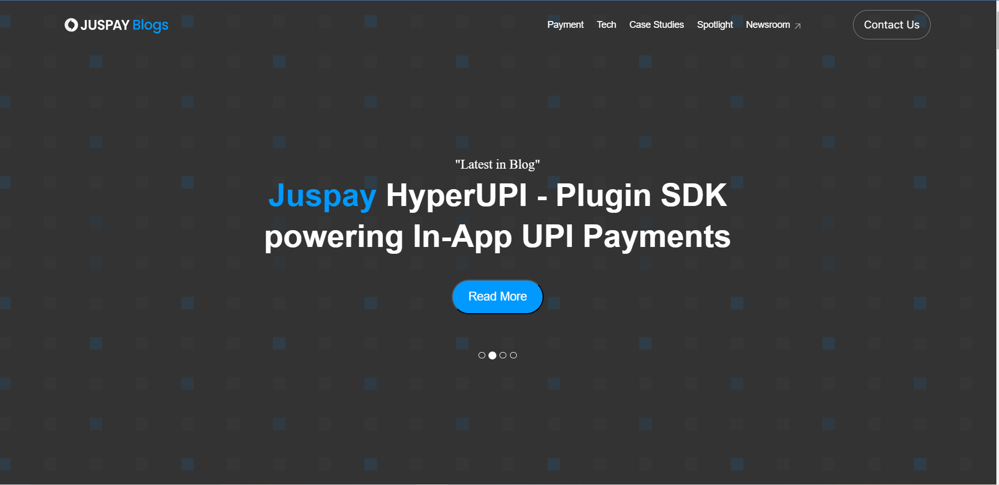
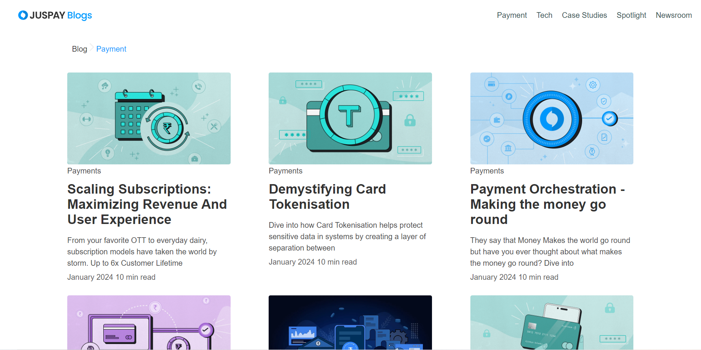
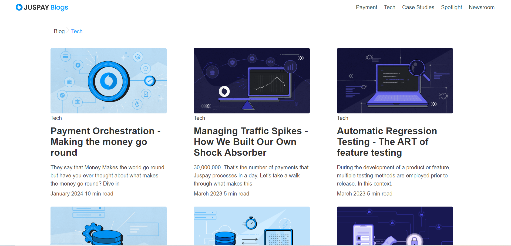
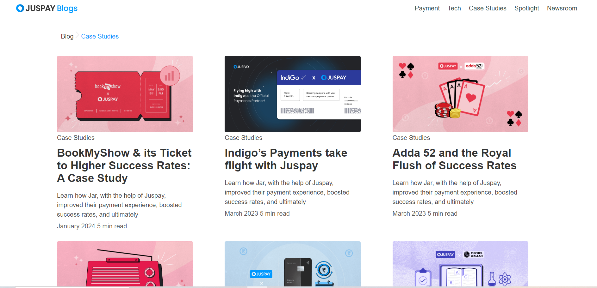
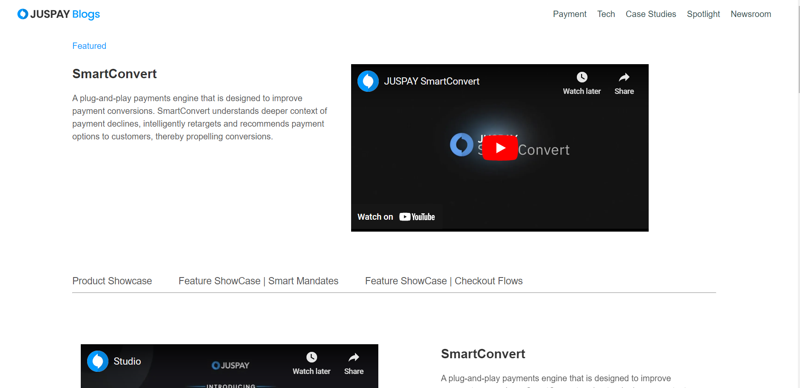
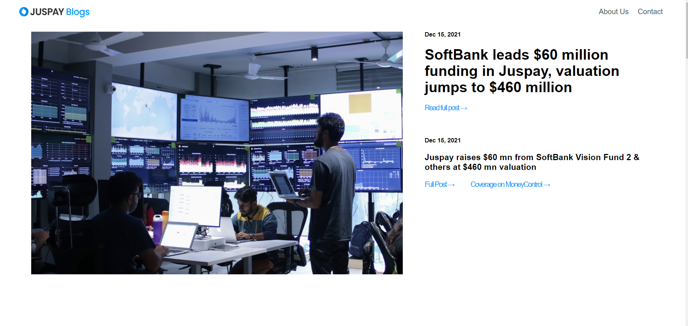

# JusPay

Juspay is a leading Indian fintech company that specializes in providing innovative payment solutions for digital businesses. Their services include payment gateway integration, digital wallet solutions, and recurring payments, all aimed at delivering a seamless and secure payment experience for businesses and consumers. With a focus on innovation and reliability, Juspay is driving the evolution of digital payments in the global financial landscape.

# Contribution to Juspay Blogpage,Paymentpage,Techpage,Case Studiespage,Spotlight,Newsroom

## Abhishek A L Contribution
- *Name*: Abhishek A L
- *Role*: Team Member 
- *Contribution*: Created the blogpage of Juspay using HTML, CSS, and JavaScript.
- *Key Features*: Implemented a responsive design catering to both laptop and mobile views.
## [LinkedIn Profile](https://www.linkedin.com/posts/activity-7161240612090908672-_-xN?utm_source=share&utm_medium=member_desktop)

## Technologies Used
- *HTML*: Used for structuring the content of the webpage.
- *CSS*: Utilized for styling and layout design, ensuring an aesthetically pleasing interface.
- *JavaScript*: Implemented for adding interactivity and dynamic elements to the webpage.
- *Bootstrap*: Used for cursor the content of the Blogpage.

## Purpose
- *Clone Development*: Creating a replica of the Juspay blogpage,paymentpage,techpage,Case Studiespage,Spotlight,Newsroom using HTML, CSS, and JavaScript.
- *Learning Experience*: Enhancing skills in web development and gaining practical experience with front-end technologies.

# Getting Started

To get started with the Juspay Website Clone, follow these steps:

## 1. Clone the Repository
- Clone the project repository to your local machine using Git:

## 2. Open the Project Directory
- Navigate to the project directory using the command line:

## 3. Open in a Code Editor
- Open the project folder in your preferred code editor.

## Description
- Created the initial structure of the blogpage using HTML.
- Styled the blogpage layout using CSS to match the design guidelines of Juspay.
- Implemented interactive elements such as navigation menu toggling and carousel sliders using JavaScript.
- Ensured responsiveness and cross-browser compatibility of the homepage.
- Implemented interactive elements such as carousel sliders using Bootstrap.

## Screenshots

## Screenshots

## Screenshots

## Screenshots

## Screenshots

## Screenshots

### Laptop View

### Mobile View

# Conclusion

## Learning Experience
Creating the Juspay homepage clone has been an enriching journey for me. Throughout the project, I've delved deep into the intricacies of web development, honing my skills in HTML, CSS, and JavaScript. From structuring the content to implementing interactive elements, every step has been a valuable learning opportunity.

## Skills Enhancement
By working on this project, I've gained a deeper understanding of responsive design principles, cross-browser compatibility, and user experience optimization. These skills are essential for creating modern, user-friendly interfaces that meet the needs of today's digital consumers.

## Practical Application
The practical experience gained from building the Juspay homepage clone has been invaluable. It has allowed me to apply theoretical knowledge to real-world scenarios, reinforcing my understanding of web development concepts and techniques.

## Future Endeavors
As I continue my journey in web development, I look forward to applying the skills and knowledge gained from this project to future endeavors. Whether it's creating new projects or enhancing existing ones, I'm confident that the experience gained here will serve as a solid foundation for my future success.

## Gratitude
I'm grateful for the opportunity to work on this project and would like to thank everyone involved for their support and guidance. It's been a rewarding experience, and I look forward to applying what I've learned to future projects and endeavors.